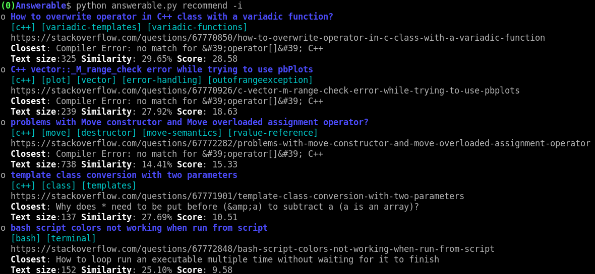

<p align="center">
    
</p>
<h1 align="center">Answerable</h1>
<h3 align="center">Recommendation system for Stack Overflow unanswered questions</h3>
<p align="center">
	<a href="LICENSE">
        
    </a>
	
	
	<a href="https://github.com/MiguelMJ/Answerable/wiki">
        
    </a>
	<a href="https://github.com/psf/black">
        
    </a>
</p>


Answerable is a Python program that learns from your answers in Stack Overflow and use them to recommend questions that you could answer.

**Preview**

<p align="center"></p>

**Table of contents**

<span id="toc"></span>

  - [Quick guide](#Quick-guide30)
  - [Contributors](#Contributors60)
  - [Contributing](#Contributing66)
  - [To do](#To-do77)
  - [License](#License99)

<h2 id="Quick-guide30">Quick guide</h2> 

[[TOC](#toc)]

- Clone the repository

    ```bash
    git clone https://github.com/MiguelMJ/Answerable.git
    ```

- Install dependencies

    ```bash
    pip install -r requirements.txt
    ```

- Save the user (see [how to get your relevant user information](https://github.com/MiguelMJ/Answerable/wiki/Getting_user_info))

    ```bash
    python answerable.py save -u ID [-t FILE]
    ```

- Get information of your profile

    ```bash
    python answerable.py summary -u ID
    ```

- Get recommendations

  ```bash
  python answerable.py recommend -u ID
  ```

_To see a more complete guide, visit the [wiki](https://github.com/MiguelMJ/Answerable/wiki)._

<h2 id="Contributors60">Contributors</h2> 

[[TOC](#toc)]

Be the first on this list!

<h2 id="Contributing66">Contributing</h2> 

[[TOC](#toc)]

- Find the contributing guidelines in [CONTRIBUTING.md](CONTRIBUTING.md).

- You can also contribute by testing the program yourself and reporting any issue [](https://github.com/MiguelMJ/Answerable/issues).
- Give this project some visibility and feedback:
  - :star: Star this repository [](https://github.com/MiguelMJ/Answerable/stargazers).
  - :arrow_up: Upvote it in [Stack Apps](https://stackapps.com/questions/8805/placeholder-answerable-a-recomendator-of-unanswered-questions) and comment your feedback there.

<h2 id="To-do77">To do</h2> 

[[TOC](#toc)]

- [x] Test all documented behaviour (argument usage).
- [x] Limit the number of answers retrieved from users with too many answers.
  - Too many answers reduce the recommendation quality.
  - Too many answers drastically increases the retrieval time.
- [ ] Allow said users to set which answers want to use.
  - Use X newest, X most popular or the whole activity history (maybe add a time estimation for this last option).
- [x] Implement statistics for `summary` command.
- [ ] For new users without answers, we could add the option to just select questions that they would like to have answered.

**Low priority**

- [ ] Include the rest of the Stack Exchange communitites.
- [ ] Make a GUI.
- [ ] Add flexible filters (Don't show questions with negative score e.g).
- [ ] Display statistics about the information taken into account to make the recommendations.
- [ ] Try out more learning models and integrate them.
- [ ] Adapt behaviour for users with authentication token.

<h2 id="License99">License</h2> 

[[TOC](#toc)]

Answerable uses the MIT license, a copy of which you can find [here](LICENSE), in the repo.

